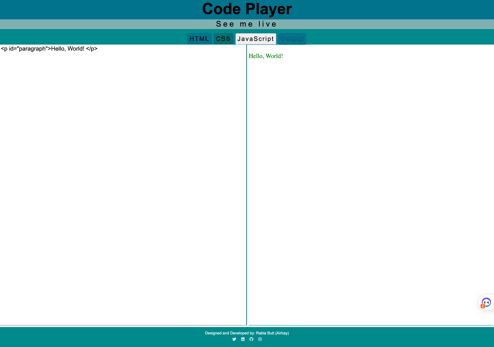

# CodePlayer

CodePlayer is a web-based code editor that provides display panels for HTML, CSS, JavaScript, and live output. It uses jQuery to enhance the user experience and allows you to see the live response of your code.

**Link to project:** [Code-Player](https://see-me-live.netlify.app/)

## View

## Working

## Features

- Separate panels for HTML, CSS, JavaScript, and output.
- Real-time rendering of the output based on the code entered.
- Easy-to-use interface for editing and previewing code.
- The output panel is always visible and cannot be edited.
- Supports jQuery library for enhanced functionality.

## Usage

1. Open the CodePlayer website in your web browser.
2. You will have options to see four display panels: HTML, CSS, JavaScript, and output.
3. Enter your HTML code in the HTML panel. This includes the structure and content of your web page.
4. Add any CSS styling rules in the CSS panel to customize the appearance of your web page.
5. Use the JavaScript panel to add interactivity and dynamic behavior to your web page.
6. The output panel will automatically update in real-time to reflect the changes made in the HTML, CSS, and JavaScript panels.
7. To disable editing in the output panel, it has been made read-only.
8. Experiment with different code combinations to see the live response in the output panel.

## Technologies Used

- HTML5
- CSS3
- JavaScript
- jQuery

## How to Contribute

If you'd like to contribute to CodePlayer, you can follow these steps:

1. Fork the repository.
2. Create a new branch for your changes.
3. Make your modifications and improvements.
4. Test your changes thoroughly.
5. Commit your changes with descriptive commit messages.
6. Push your changes to your forked repository.
7. Submit a pull request to the original repository.

## Acknowledgements

- The CodePlayer project is inspired by various online code editors and learning platforms.
- I would like to express our gratitude to the open-source community for their valuable contributions.

## Contact

For any inquiries or feedback, please contact at [Rabia Butt](mailto:air.bay.x@gmail.com?subject=[GitHub]%20Source%20Han%20Sans)

---

Thank you for using CodePlayer! Hope you find it helpful in your coding journey.
